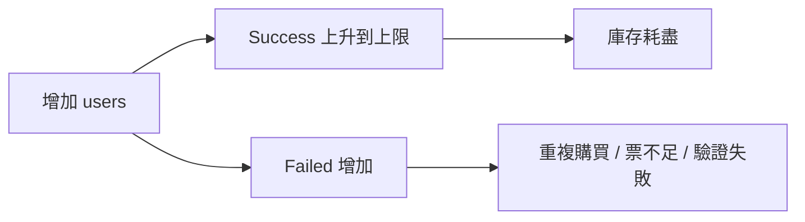

# 期末報告參考：JAVA Final Project（搶票系統）

這份文件是給期末報告 / 簡報用的整理提綱，不是正式報告正文。目標是把這個專案的「AI coding 歷程 + Git history + 成果展示」串成一條清楚的故事線，讓簡報可以直接照著做。

## 一、簡報主軸

建議把報告主軸寫成：

「從一個基本的 Java Socket + Swing 搶票雛形，透過 AI 協作、逐步重構、壓測驗證、後台管理與持久化，演進成一個具備可展示、可測試、可追蹤版本歷程的完整期末專題。」

這樣的敘事可以把 AI 對話、Git commit / tag、功能演進與測試結果全部串起來。

## 二、建議簡報架構

### 1. 專案介紹

- 專案名稱：JAVA Final Project - 搶票系統（Seckill Simulation）
- 核心技術：Java、Swing、Socket、執行緒池、檔案持久化
- 系統目標：模擬票券搶購流程，包含前台購票、後台查詢、壓測與資料保存

### 2. 初始版本與問題

- 一開始的系統是最基本的搶票雛形，功能單純、介面也比較陽春。
- 早期問題可以聚焦在：UI 不完整、流程不夠直覺、缺少測試工具、沒有後台管理、缺少狀態保存。
- 這一段可以放「優化前截圖」與「v0 baseline」的 Git 截圖。

### 3. AI 協作與重構歷程

- 把 AI chat session 當成「設計討論紀錄」來用。
- 可以挑幾段代表性對話：
  - UI 改版需求
  - 第二頁排版修正
  - 驗證碼刷新
  - 壓測腳本設計
  - RESET / ADMIN 指令
  - CSV 匯出
  - token 驗證與持久化
- 簡報上可以放「需求 → AI 建議 → 程式修改 → 驗證結果」的流程圖。

### 4. 版本演進

建議用一張時間軸或表格呈現版本演進：

| 版本 | 內容 |
| --- | --- |
| 初始版本 / v0-baseline | 建立最基本 Socket + Swing 搶票雛形 |
| v1.0 | 兩步驟 UI、多票種分區、驗證碼、剩餘票數顯示 |
| v1.1 | 修正第二頁表單跑位、驗證碼可點擊刷新 |
| v1.2 | 表單重入清空、張數改下拉選單 |
| v1.3 | 新增單機壓測腳本 |
| v1.4 | 新增 RESET 指令 |
| v2.0.0-rc1 | 壓測結果 CSV 匯出 |
| v2.0.0-rc2 | 新增 ADMIN 查詢工具 |
| v2.0.0 | 持久化、token 驗證、正式版收尾 |

### 5. 技術決策

可以挑 3 到 5 個技術決策講清楚原因：

- 為什麼用 TCP Socket：實作簡單、適合課堂展示 client/server 架構。
- 為什麼用執行緒池：可以同時處理多個連線，避免每個請求都建立新執行緒。
- 為什麼用 `synchronized` / `AtomicInteger` / `ConcurrentHashMap`：避免庫存與訂單在併發下出錯。
- 為什麼加入 RESET：方便壓測重複執行，不用每次重啟伺服器。
- 為什麼加入 token：讓後台指令不要被隨意操作。
- 為什麼加入持久化：讓重啟後狀態可恢復，也更像真實系統。

### 6. 測試與驗證

這一段很適合放圖表或表格：

- 壓測前後票況截圖
- 成功 / 失敗統計
- 失敗原因 breakdown
- 平均延遲與 P95 延遲
- CSV 匯出結果

如果時間夠，可以放一個簡單圖表：

### 7. Demo 成果

Demo 建議只示範最能代表專案完成度的部分：

- 開啟客戶端兩步驟購票流程
- 顯示票況更新與驗證碼刷新
- 成功送出一筆訂單
- 用管理工具查詢 SUMMARY / ORDERS
- 用壓測腳本跑一次 RESET + CSV
- 展示持久化在重啟後仍可恢復狀態

## 三、建議附上的截圖

簡報中可以準備這些圖：

1. 初始版介面截圖
2. v1.0 新 UI 截圖
3. v1.1 第二頁修正版截圖
4. v1.2 下拉張數與表單清空示意
5. 壓測腳本執行畫面
6. `RESET` 前後票況對照
7. `ADMIN|SUMMARY` / `ADMIN|ORDERS` 輸出
8. CSV 檔案內容或 Excel 圖表
9. Git tag / commit 歷史畫面
10. AI chat session 關鍵對話截圖

## 四、可以直接講的結論

- 這個專案不是一次做完，而是透過多輪 AI 協作與版本迭代逐步完成。
- 每個版本都有清楚目的，且可以從 Git tag 與 commit 記錄回溯。
- v2 已經具備完整期末展示所需的功能：UI、壓測、後台、token、安全、持久化。
- v3 若要再做，方向應該是資料庫、權限分級、測試與部署現代化，而不是再補幾個小功能。

## 五、簡報收尾建議

最後一頁可以放這句話：

「本專案的價值不只是在完成一個搶票系統，而是在完整保留從需求討論、AI 協作、程式重構、測試驗證到版本管理的整個開發歷程。」
